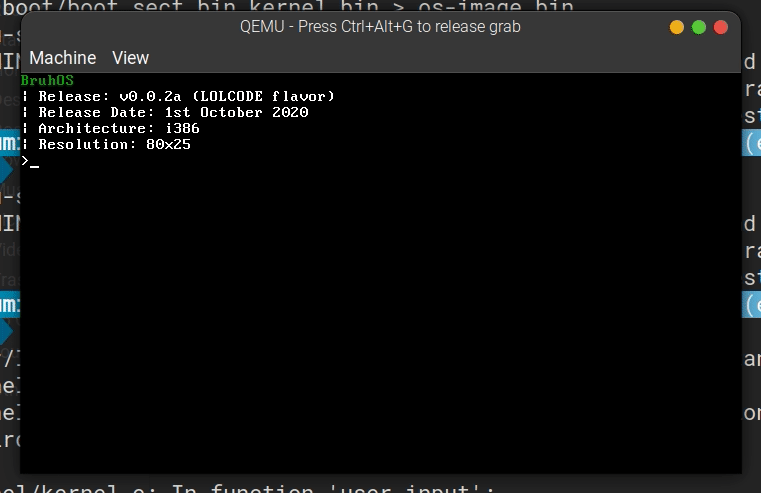

# BruhOS + LOLCODE

## What?

Small kernel in C, Assembly, and LOLCODE with extensible LOLCODE support

This is a very basic 32 bit kernel.

Handles Keyboard input, can integrate lolcode directly into the kernel.

Has a basic shell, with basic memory allocation for arrays, strings etc.

More stuff like math commands can easily be added, since a sizeable standard library is included.

You can build this kernel, using the steps given at the end of this README, but setting up the i386 cross compiler can take ages (took ~3 hours on my 8 thread 4 core i5 10th gen CPU), also requires you to setup the LCC project for lolcode integration with dependencies, and multicore support on x86 systems, not to mention QEMU, Make, for testing the kernel. However, a basic demo gif is included below.

Supports basic commands like:

- `MOO <TEXT>` where it makes an ascii cow repeat the text
- `PANIC` that simulates a kernel panic (no debug info or kernel halt for now)
- `SLEEP` that makes the kernel sleep for some amount of time, basically doing no task
- `KILL` that kills the kernel

More can easily be added, but I'm kind of short on time since most of my time went into getting my kernel to boot with my custom NASM bootloader 😅


### Small Demo:



Again, this might look basic, but I tried focusing on extensibility, and future proofing instead of packing unstable features into it in a short span of time.

## Why?

Why not? The idea behind working on BruhOS (currently a private repo, which is
WIP) and [assembly-fun](https://github.com/soumitradev/assembly-fun) has always been "Why the fuck not, let's try it"

I now have LOLCODE being compiled to C, and then run in kernel. As of now, only
the Hello World works, and basic printing.

This is also still WIP. More LOLCODE features will be gradually added as I
continue working on the `lol.h` and `lollib` files to add support for more stuff.

Special thanks to the [LCC project](https://github.com/browndeer/lcc/), which is the only way I could get LOLCODE running at the low level:

[https://github.com/browndeer/lcc/](https://github.com/browndeer/lcc/)

That project is also the reason this repo is licensed under the [GPLv3 License](./LICENSE)

It's the same idea as in [assembly-fun](https://github.com/soumitradev/assembly-fun) but now with LOLCODE support.

If you have no idea what I'm talking about, here's the original readme quoted:

> Recently, I looked at [@geohot](https://github.com/geohot)'s video of adding fore loops to Clang.
> I really wanted to learn more about Clang and LLVM, so I looked into it.
> On a whim, I thought "Hmm... let's make our own basic OS from scratch."
> And I did. I tried atleast.
> This are the basic steps leading up to a 32-bit OS made entirely from scratch. No Bootloader, no Stivale, and no prior knowledge of C or Assembly needed. I do, however recommend watching some of Ben Eater's videos on YouTube to understand better how programs run at the _really_ low level. Like the binary level.
> This is still a WIP project, and I'm still learning.
> `latest` contains the latest code I've written, and the other folders contain older code that I wrote while learning. After this becomes big enough, it will move to its own repository where it will be a standalone OS.
> I used `bochs` for testing inititally, now I use `qemu`, `nasm` for compiling my Assembly code. The `.bin` files are the compiled machine code.
> All code is for the original i386 architecture.
> Old comment:
> > The `./latest/bochsrc` contains the config for the latest OS image. You'll have to modify it for every subfolder to run each image. Maybe I'll automate this config generation, compilation and testing later.
> All builds have been moved to `Make`. A Makefile is included in the newer folders. The old ones still use bochs.
> I failed at paging. I loaded kernel at 0x1000. This OS was 32-bit. Better I start 64 bit afresh. Apparently it's easier.

## Installation and Build

**Not Reccomended: the kernel is not worth the hours of wait required to setup the build tools**

1. Install Make, build-essential and other general C/C++ development tools
1. Install an i386 cross compiler:

> ### Required packages
> 
> First, install the required packages. On linux, use your package distribution. On a Mac, [install brew](http://brew.sh/) if
> you didn't do it on lesson 00, and get those packages with `brew install`
> 
> - gmp
> - mpfr
> - libmpc
> - gcc
> 
> Yes, we will need `gcc` to build our cross-compiled `gcc`, especially on a Mac where gcc has been deprecated for `clang`
> 
> Once installed, find where your packaged gcc is (remember, not clang) and export it. For example:
> 
> ```
> export CC=/usr/local/bin/gcc-4.9
> export LD=/usr/local/bin/gcc-4.9
> ```
> 
> We will need to build binutils and a cross-compiled gcc, and we will put them into `/usr/local/i386elfgcc`, so
> let's export some paths now. Feel free to change them to your liking.
> 
> ```
> export PREFIX="/usr/local/i386elfgcc"
> export TARGET=i386-elf
> export PATH="$PREFIX/bin:$PATH"
> ```
> 
> ### binutils
> 
> Remember: always be careful before pasting walls of text from the internet. I recommend copying line by line.
> 
> ```sh
> mkdir /tmp/src
> cd /tmp/src
> curl -O http://ftp.gnu.org/gnu/binutils/binutils-2.24.tar.gz # If the link 404's, look for a more recent version
> tar xf binutils-2.24.tar.gz
> mkdir binutils-build
> cd binutils-build
> ../binutils-2.24/configure --target=$TARGET --enable-interwork --enable-multilib --disable-nls --disable-werror > --prefix=$PREFIX 2>&1 | tee configure.log
> make all install 2>&1 | tee make.log
> ```
> 
> ### gcc
> 
> ```sh
> cd /tmp/src
> curl -O https://ftp.gnu.org/gnu/gcc/gcc-4.9.1/gcc-4.9.1.tar.bz2
> tar xf gcc-4.9.1.tar.bz2
> mkdir gcc-build
> cd gcc-build
> ../gcc-4.9.1/configure --target=$TARGET --prefix="$PREFIX" --disable-nls --disable-libssp --enable-languages=c > --without-headers
> make all-gcc 
> make all-target-libgcc 
> make install-gcc 
> make install-target-libgcc 
> ```

1. Install QEMU for x86

1. Install LCC: [https://github.com/browndeer/lcc/#for-x86-multi-core-workstation](https://github.com/browndeer/lcc/#for-x86-multi-core-workstation)

1. Run `make run`, cross your fingers and hope you installed it correctly
